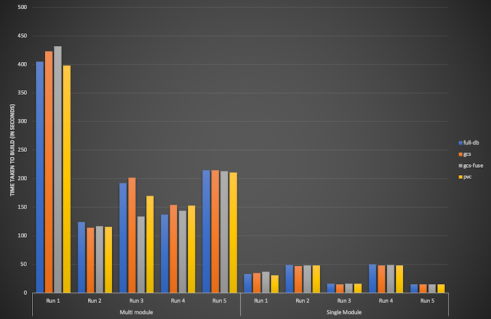

# Benchmark Artifactory Binary Providers in GKE 

## Objective

Artifactory supports
[number of binary providers](https://www.jfrog.com/confluence/display/RTF/Configuring+the+Filestore#ConfiguringtheFilestore-ChainsandBinaryProviders).
Objective of this project is evaluate GKE specific options, which are

- PVC based filesystem
- GCS
- Full-DB
- GCS-FUSE

## Scenario
Benchmark is done using two maven project

1. **S1**: Simple Test using POM only project for importing third party jars
   (31) into Aritifactory
2. **S2**: Stress Test using Multi-module (68 modules) java project
   which downloads 1200+ artifacts and uploads (deploy) \~200 artifacts
   
## Result



#### S1: Single module maven project 
*all times in seconds*

|          | gcs-fuse |   gcs |   pvc | full-db |
|----------|---------:|------:|------:|--------:|
|Run 1     |       37 |    35 |    31 |      33 |
|Run 2     |       48 |    47 |    48 |      49 |
|Run 3     |       16 |    15 |    16 |      16 |
|Run 4     |       49 |    48 |    48 |      50 |
|Run 5     |       15 |    15 |    15 |      15 |

#### S2: Multi-module maven project
*all times in seconds*

|          | gcs-fuse |   gcs |   pvc | full-db |
|----------|---------:|------:|------:|--------:|
|Run 1     |      432 |   423 |   398 |     405 |
|Run 2     |      117 |   114 |   116 |     124 |
|Run 3     |      134 |   202 |   170 |     192 |
|Run 4     |      144 |   154 |   153 |     137 |
|Run 5     |      213 |   215 |   211 |     215 |

## Setup

- Artifactory Version: 6.9.0
- Helm Chart Version: [7.13.7](./install/cloudbuild.yaml) from [jfrog](https://github.com/jfrog/charts/tree/master/stable/artifactory)
- GCS-FUSE Version: [0.27.0](https://github.com/GoogleCloudPlatform/gcsfuse/releases/tag/v0.27.0)
- [GKE Cluster](./infra/gke.tf)

    |                 | Value         |
    |:----------------|:--------------|
    | Version         | 1.12.6-gke.10 |
    | Location        | us-central    |
    | Machine Type    | n1-standard-4 |
    | Number of Nodes | 2             |
    | Total cores     | 8             |
    | Total memory    | 30 GB         |
    
## Configuration
#### GCS-FUSE
`gcsfuse` installed by extending artifactory-pro docker image
[Dockerfile](images/artifactory-fuse/Dockerfile). Startup as part of
container [using](images/artifactory-fuse/start-gcsfuse.sh) following command

```bash
gcsfuse --temp-dir /tmp --foreground --key-file ${GCS_CREDENTIALS} \
        ${GCS_FUSE_OPTS} ${BUCKET} /mnt/gcsfuse
```

> gcsfuse needs sys priviledge to mount GCS storage as local directory. Refer [this link](https://stackoverflow.com/questions/34758090/use-gcsfuse-to-mount-google-cloud-storage-buckets-in-a-docker-container)

```xml
<config version="2">
    <chain>
        <provider id="cache-fs" type="cache-fs">
            <provider id="eventual" type="eventual">
                <provider id="retry" type="retry">
                    <provider id="gcsfuse-fs" type="file-system"/>
                </provider>
            </provider>
        </provider>
    </chain>

    <provider id="cache-fs" type="cache-fs">
        <maxCacheSize>100000000000</maxCacheSize>
        <cacheProviderDir>/var/opt/jfrog/artifactory/cache</cacheProviderDir>
    </provider>

    <provider id="gcsfuse-fs" type="file-system">
        <fileStoreDir>/mnt/gcsfuse/filestore</fileStoreDir>
    </provider>
</config>
```

#### GCS

Refer [this link](https://www.jfrog.com/confluence/display/RTF/Configuring+the+Filestore#ConfiguringtheFilestore-GoogleStorageBinaryProvider) for more info.
```xml
<config version="2">
    <chain>
        <provider id="cache-fs" type="cache-fs">
            <provider id="eventual" type="eventual">
                <provider id="retry" type="retry">
                    <provider id="google-storage" type="google-storage"/>
                </provider>
            </provider>
        </provider>
    </chain>

    <!-- Set max cache-fs size -->
    <provider id="cache-fs" type="cache-fs">
        <maxCacheSize>100000000000</maxCacheSize>
        <cacheProviderDir>/var/opt/jfrog/artifactory/cache</cacheProviderDir>
    </provider>

    <provider id="file-system" type="file-system">
        <fileStoreDir>/var/opt/jfrog/artifactory/data/filestore</fileStoreDir>
    </provider>

    <provider id="google-storage" type="google-storage">
        <providerId>google-cloud-storage</providerId>
        <endpoint>commondatastorage.googleapis.com</endpoint>
        <httpsOnly>false</httpsOnly>
        <bucketName>artifactory-gcsstore</bucketName>
        <identity>xxxxxxxx</identity>
        <credential>xxxxxxxx</credential>
        <path>artifactory/filestore</path>
    </provider>
</config>
```

#### FullDB
Refer [this link](https://www.jfrog.com/confluence/display/RTF/Configuring+the+Filestore#ConfiguringtheFilestore-Full-DBBinaryProvider) for more info.
```xml
<config version="2">
    <chain>
        <provider id="cache-fs" type="cache-fs">
            <provider id="eventual" type="eventual">
                <provider id="retry" type="retry">
                    <provider id="blob" type="blob"/>
                </provider>
            </provider>
        </provider>
    </chain>

    <provider id="cache-fs" type="cache-fs">
        <maxCacheSize>100000000000</maxCacheSize>
        <cacheProviderDir>/var/opt/jfrog/artifactory/cache</cacheProviderDir>
    </provider>

    <provider id="file-system" type="file-system">
        <fileStoreDir>/var/opt/jfrog/artifactory/data/filestore</fileStoreDir>
    </provider>
</config>
```

#### PVC
Refer [this link](https://www.jfrog.com/confluence/display/RTF/Configuring+the+Filestore#ConfiguringtheFilestore-FilesystemBinaryProvider) for more info.
```xml
<config version="v1">
    <chain template="file-system"/>
</config>
```
